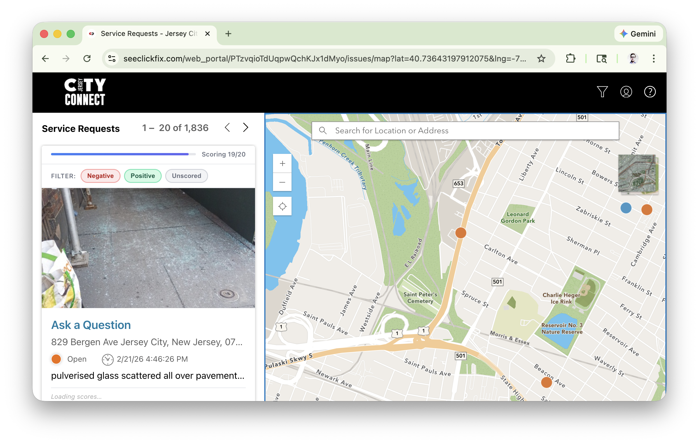
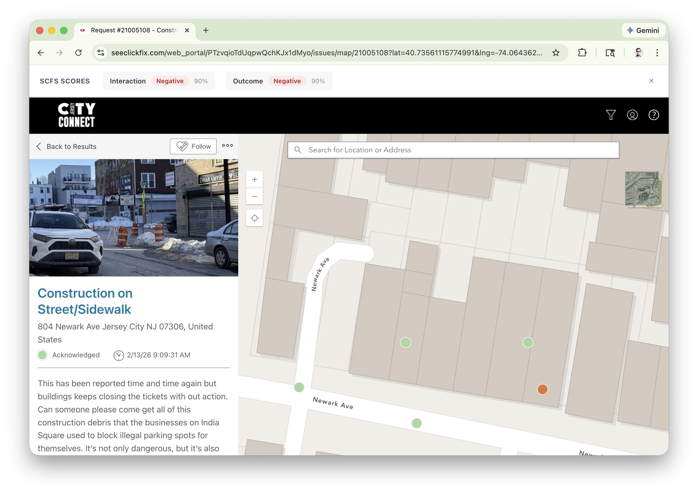

# SCFS Issue Scores — Chrome Extension

A Chrome extension that adds AI-powered sentiment scores to [SeeClickFix](https://seeclickfix.com) service requests for Jersey City. Each issue gets an **Interaction** score and an **Outcome** score so you can quickly see how the city is handling reports.

## What it does

**On the issues map/list view** — scores appear inline on each issue card with a progress bar and filter buttons (Negative / Positive / Unscored):



**On an individual issue page** — a banner appears at the top showing Interaction and Outcome sentiment with confidence percentages:



## Install from a release (recommended)

1. Go to the [Releases page](https://github.com/HackJerseyCity/scfs-chrome/releases) and download the latest `scfs-chrome-vX.X.zip`
2. Unzip the file
3. Open Chrome and go to `chrome://extensions`
4. Turn on **Developer mode** (toggle in the top-right corner)
5. Click **Load unpacked**
6. Select the unzipped folder
7. Visit [seeclickfix.com](https://seeclickfix.com/web_portal/PTzvqioTdUqpwQchKJx1dMyo/issues/map) — scores will appear automatically

## Install from source

```sh
git clone https://github.com/HackJerseyCity/scfs-chrome.git
cd scfs-chrome
```

Then follow steps 3–7 above, pointing "Load unpacked" at the cloned repo directory.

## Updating

When a new release is available:

1. Download and unzip the new release (or `git pull` if you installed from source)
2. Go to `chrome://extensions`
3. Click the reload icon on the SCFS Issue Scores card

## How it works

The extension runs a content script on `seeclickfix.com` pages. It extracts issue IDs from the page, fetches sentiment scores from the SCFS API (`scfs-api.hackjc.org`), and injects the results into the page. Scores are cached per session to avoid redundant API calls.

## Development

```sh
make zip        # Build a distributable zip
make tag        # Tag the current version from manifest.json and push
make release    # Tag + zip (for use with GitHub Actions)
```

## License

MIT
